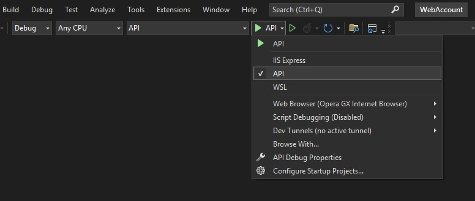
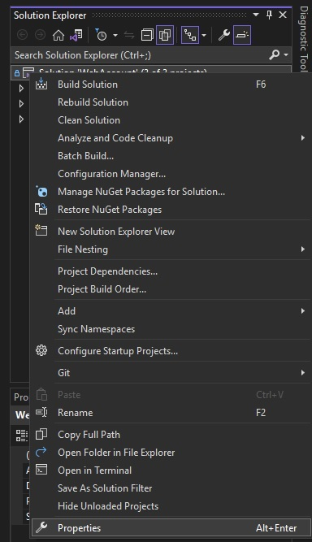
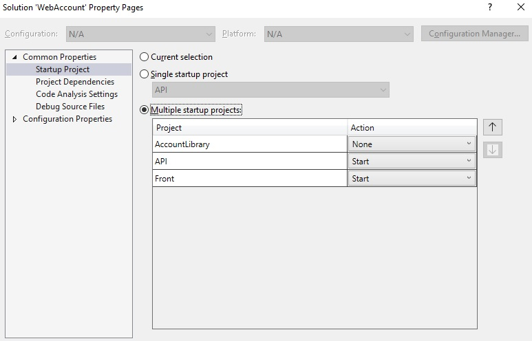

# Web Account

It's a web service with which you can manage your Housing and Communal Services (HCS) accounts through an easy-to-understand web interface.
## Features

- Create a new account
- Delete an account
- Manage residents
- Manage account data
- Search with filters


## Run Locally

#### Clone the project

```bash
  git clone https://github.com/CoffeeBoi-1/WebAccount
```

#### Open with Visual Studio 2022

#### Choose the API run method instead of IISExpress.


#### Open Solution Properties.


#### Open Startup Project > Multiple startup projects > API and Front set to 'Start' 

## Technologies


